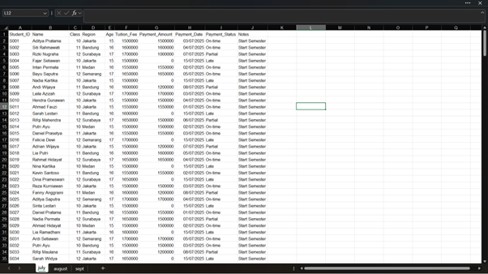
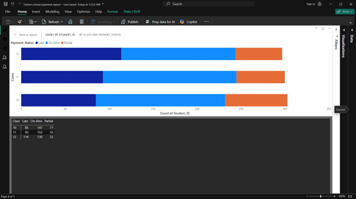
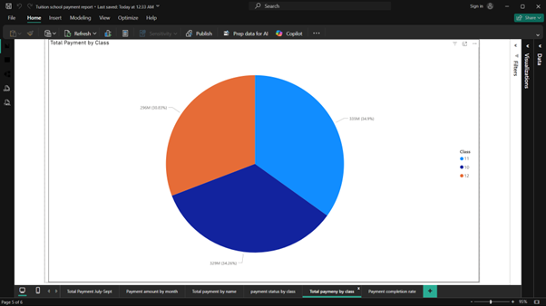
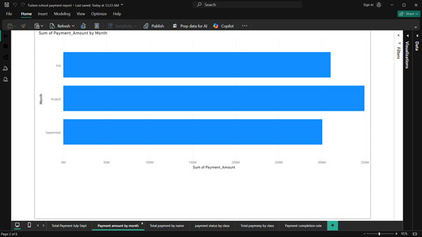
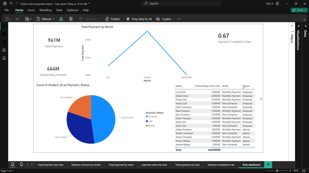

# Payment Data Analysis Dashboard (July – September 2025)

## Project Overview
This project analyzes student tuition payment data from **July to September 2025** to monitor payment behavior, identify late or partial payments, and generate actionable insights for improving cash flow management.

Using **Power BI**, this dashboard transforms raw Excel data into interactive visualizations that help stakeholders quickly understand:

- How much money has been collected
- Outstanding balances
- Payment trends over time
- Students who require follow-up

The final result is a clean, business-focused dashboard that supports better financial decision-making.

---

# Goals

The main objectives of this project are:

✅ Track total payments collected each month  
✅ Identify on-time, late, and partial payments  
✅ Monitor outstanding tuition balances  
✅ Detect high-risk students or regions  
✅ Support follow-up and cash flow planning  

---

# Tools & Technologies

- **Power BI** → Data modeling & dashboard
- **Excel** → Data source
- **Power Query** → Data cleaning & transformation
- **DAX** → KPI calculations & measures
- **GitHub** → Documentation & version control

---

# Dataset Information

### Columns used:
- Student_ID
- Name
- Class
- Region
- Age
- Tuition_Fee
- Payment_Amount
- Payment_Date
- Payment_Status (On-time / Partial / Late)
- Notes

### Data Preparation Steps:
- Combined monthly sheets (July, August, September)
- Standardized column names
- Handled missing payment dates
- Created calculated measures:
  - Total Payment
  - Outstanding Amount
  - Outstanding per Student
  - Completion Rate
  - Late Payments count

---

---

# Dashboard & Analysis

---

## 1. Raw Data Source (Excel)



### Description
The raw dataset contains student-level tuition payment records including payment status, date, and amount.

### Insight
- Data structured per student
- Enables tracking of individual behavior
- Supports student-level follow-up analysis

---

---

## 2. Payment Status by Class



### Description
Stacked bar chart showing the number of students by payment status (On-time, Partial, Late) for each class.

### Key Insights
- Some classes show higher late/partial payments
- Class-level trends help identify which groups need closer monitoring
- Allows targeted reminders instead of mass communication

### Business Value
Enables **class-based intervention strategies**

---

---

## 3. Total Payment Distribution by Class



### Description
Pie chart showing total tuition payments collected from each class.

### Key Insights
- Reveals which classes contribute the most revenue
- Highlights dependency on specific classes
- Useful for financial forecasting

### Business Value
Understand **revenue concentration risk**

---

---

## 4. Payment Amount by Month



### Description
Bar chart comparing total payment amounts across July, August, and September.

### Key Insights
- Clear monthly fluctuations in cash inflow
- Identifies peak and low collection months
- Helps predict future cash flow patterns

### Business Value
Supports **cash flow planning & budgeting**

---

---

## 5. Final Interactive Dashboard



### Description
Main executive dashboard combining KPIs and visualizations.

### Included Components

### KPI Cards
- Total Payment
- Outstanding Amount
- Completion Rate
- Student Count

### Line Chart
Monthly payment trend

### Pie Chart
Payment status distribution

### Follow-up Table
Students with outstanding balances

---

### Key Insights

### Payment Behavior
- Majority pay on-time
- Partial payments increasing in later months

### Risk Detection
- Several students show consistent late payments
- Outstanding balances may impact cash flow

### Financial Health
- Completion rate shows overall payment performance
- Quick snapshot for management decisions

---

# Key DAX Measures Used

```DAX
Total Payment =
SUM(Student_Payment[Payment_Amount])

Outstanding Amount =
SUM(Student_Payment[Tuition_Fee]) - SUM(Student_Payment[Payment_Amount])

Outstanding per Student =
SUM(Student_Payment[Tuition_Fee]) - SUM(Student_Payment[Payment_Amount])

Completion Rate =
DIVIDE([Total Payment], SUM(Student_Payment[Tuition_Fee]))
